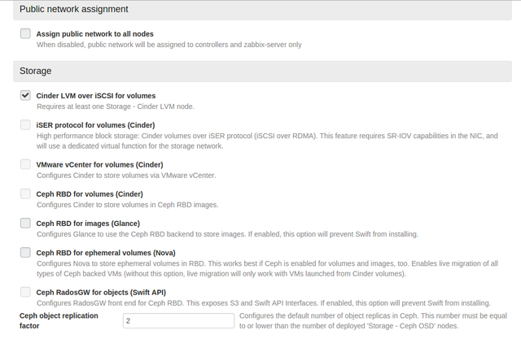

User Guide 
==========

Homepage
+++++

The OPS-Deploy's UI is accessible at the default url http://10.20.0.2:8000/. Using the admin credentials (by default they are admin/admin),the user is able to access to the Dashboard (see Fig. 1).

.. image:: _static/OPS-Deploy-1.png
     :alt: OPS-Deploy homepage
     :align: center
     :scale: 75%
*Fig. 1: OPS-Deploy homepage*

The user sets bare-metal servers to boot from network via PXE and power them on. They will start automatically with a bootstrap operating system, based on Centos. The OPS-Deploy will notify discovered nodes on OPS-Deploy UI (see Fig. 1 in the upper right corner) and the user can create a new environment.

.. image:: _static/OPS-Deploy-2.png
     :alt: Creation of a new environment
     :scale: 75%
*Fig. 2: Creation of a new environment*
     
     
The first step that involves the user is the “New Openstack Environment” creation (Fig. 2), where the user inserts such basic information about the environment as name, operating system, deployment mode (multi-node or multi-node with High Availability), hypervisor and network manager (Nova-Network, Neutron with GRE, Neutron with VLAN).

Now the environment is ready for deployment (Fig. 3).

.. image:: _static/OPS-Deploy-3.png
     :alt: The page of the created environment
     :scale: 75%
     :align: center
*Fig. 3: The page of the created environment*      
     
In environment creation process the user should define the architecture of his cloud infrastructure. The user assigns the role to every server, configures the network, defines the space allocated to hard disks and settings other Openstack options (Fig. 4).
  
.. image:: _static/OPS-Deploy-4.png
     :alt:  environment definition
     :scale: 75%
*Fig. 4:  Environment definition*      
     
Giving roles to servers
+++++

In “Nodes” tab, the user can view the state of his environment, where the nodes are ordered by Roles. Thus, the user can view the node's details and configure them appropriately.
By clicking on “Add Nodes” button, the OPS-Deploy shows users the list of available roles and the list of unallocated nodes. After selecting a role, other incompatible roles are automatically disabled. For example, a controller node cannot be together with a compute node simultaneously, and so on.
Finally the user applies changes (Fig. 5).     

.. image:: _static/OPS-Deploy-5.png
     :alt: the list of available servers
     :scale: 75%
*Fig. 5:  the list of available servers*

When the changes are applied, it is possible to tune the node, by clicking on the right button indicated by the gear icon. The OPS-Deploy shows a dialog where the user can configure network interfaces, defines the space allocated to hard disks and views server informations (e.g. Service tag, Mac addresses, hardware specifications, etc.) (Fig.6, 7, 8).

*Fig. 6:  network interfaces configuration*

.. image:: _static/OPS-Deploy-7.png
     :alt: hard disks configuration
     :scale: 75%
*Fig. 7: hard disks configuration*

.. image:: _static/OPS-Deploy-8.png
     :alt: detailed informations about the selected server
     :scale: 75%
*Fig. 8: detailed informations about the selected server*

Network settings
+++++

In the Network section, the user can manage configuration parameters. Based on the Openstack network architecture, OPS-Deploy considers four networks: Public, Management, Private and Storage. Management and Storage sections indicate the network subnet in CIDR notation and VLAN tags, whereas the Public section allows to set the IPs pool and its VLAN tag (Fig. 11). The Private Network (also named Fixed network) identifies the network between each tenant's VMs. Private network address spaces are not a part of the enterprise network address space; fixed IPs of virtual instances cannot be accessed directly from other networks and so, clearly, the private network should be isolated from other networks for security reasons. 

*Fig. 9: infrastructure network settings*

The OPS-Deploy gives user the opportunity to manage the Neutron plugin and to define the L2 connection tunnel ID range and the L3 floating IP range. Furthermore, the user can verify the network configuration by clicking the “Verify Network” button, which checks for connectivity between nodes using the configured VLANs. It also checks if if some external DHCP interferes with the current deployment (Fig. 10).

     
*Fig. 10: L2/L3 Neutron configuration*

General Settings
+++++

The "Settings" tab contains options useful to manage the current environment. Here, the user can select one or more monitoring GEs (e.g. Nagios, ContextBroker, NGSI Adapter, OpenStackDataCollector) and configure them. Moreover, the user can change the Openstack admin account or can change the hypervisor type or the scheduler driver. To make variations permanently it is necessary re-deploy the changes. (Fig. 11,12, 13, 14, 15).

.. image:: _static/OPS-Deploy-11.png
     :alt:  Infrastructure settings (Access, Additional Components)
     :scale: 75%

*Fig. 11: Infrastructure settings (Access, Additional Components)*

.. image:: _static/OPS-Deploy-1.png
     :alt: Infrastructure settings (Common)
     :scale: 75%

*Fig. 12: Infrastructure settings (Common)*

*Fig. 13 : Infrastructure settings (Kernel parameters, Syslog and Mellanox Neutron Components)*

     
*Fig. 14: Infrastructure settings (Public network assignment, Storage)*

*Fig. 15: Infrastructure settings (Monitoring: Nagios and Zabbix)*

Logs
+++++

The log section is designed to monitor the state of installation and support the troubleshooting. The user can select the node to monitoring, the log level and the generator source.

Health Check
+++++

It is very useful, running a post deployment test, to see if the installation process is correctly finished. The Health check process runs a set of tests, and when it is done, the user will see green Thumbs Up sign if it was correct and a red Thumbs Down sign if something went wrong (Fig. 16).

*Fig. 16: health check result*     

Deployment
+++++

Start deploy When the user has finished setting the environment, he can start the deployment process, clicking on "Deploy changes" button (Fig. 17).

     
*Fig. 17: installation in progress*
 
