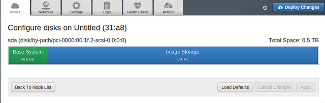
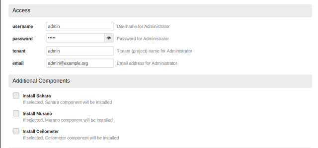

User Guide 
==========

Homepage
+++++

When the user has completed the master node installation, he can access OPS-Deploy UI, visiting the default url http://10.20.0.2:8000/ and after inserting the credentials (default: admin/admin) the screen appears like in Fig. 1.

.. image:: _static/OPS-Deploy-1.png
     :alt: OPS-Deploy homepage
     :scale: 90%
     
The user sets bare-metal servers to boot from network via PXE and power them on. They will start automatically with a bootstrap operating system, based on Centos. The OPS-Deploy will notify discovered nodes on OPS-Deploy UI (see Fig. 3 in the upper right corner). At this moment, the user could create a new environment.

.. image:: _static/OPS-Deploy-2.png
     :alt: Creation of a new environment
     :scale: 90%
     
The first step that involves the user is the “New Openstack Environment” creation (Fig. 4), where the user inserts such basic information about the environment as name, operating system, deployment mode (multi-node or multi-node with High Availability), hypervisor and network manager (Nova-Network, Neutron with GRE, Neutron with VLAN).

Now the environment is ready for deployment (Fig. 3).

.. image:: _static/OPS-Deploy-3.png
     :alt: The page of the created environment
     :scale: 90%
     
  In environment creation process the user should define the architecture of his cloud infrastructure. The user assigns the role to every server, configures the network, defines the space allocated to hard disks and settings other Openstack options (Fig.64).
  
.. image:: _static/OPS-Deploy-4.png
     :alt: The page of the created environment
     :scale: 90%
     
Giving roles to servers
+++++

In “Nodes” tab, the user can view the state of his environment, where the nodes are ordered by Roles. Thus, the user can view the node's details and configure them appropriately.
By clicking on “Add Nodes” button, the OPS-Deploy shows users the list of available roles and the list of unallocated nodes. After selecting a role, other incompatible roles are automatically disabled. For example, a controller node cannot be together with a compute node simultaneously, and so on.
Finally the user applies changes (Fig. 5).     

When the changes are applied, it is possible to tune the node, by clicking on the right button indicated by the gear icon. The OPS-Deploy shows a dialog where the user can configure network interfaces, defines the space allocated to hard disks and views server informations (e.g. Service tag, Mac addresses, hardware specifications, etc.) (Fig.8, 9, 10).

.. image:: _static/OPS-Deploy-6.png
     :alt: network interfaces configuration
     :scale: 90%
     

Network settings
+++++

In the Network section, the user can manage configuration parameters. Based on theOpenstack network architecture, OPS-Deploy considers three networks: Public, Management and Storage. Management and Storage sections indicate the network subnet in CIDR notation and VLAN tags, whereas thePublic section allows to set the IPs pool and its VLAN tag (Fig. 11).     

.. image:: _static/OPS-Deploy-9.png
     :alt: infrastructure network settings
     :scale: 90%

The OPS-Deploy gives user the opportunity to manage the Neutron plugin and to define the L2 connection tunnel ID range and the L3 floating IP range. Furthermore, the user can verify the network configuration by clicking the “Verify Network” button, which checks for connectivity between nodes using the configured VLANs. It also checks if if some external DHCP interferes with the current deployment (Fig. 12).

.. image:: _static/OPS-Deploy-10.png
     :alt:  L2/L3 Neutron configuration
     :scale: 90%

General Settings
+++++

The "Settings" tab contains options useful to manage the current environment. Here, the user can select one or more monitoring GEs (e.g. Nagios, ContextBroker, NGSI Adapter, OpenStackDataCollector) and configure them. Moreover, the user can change the Openstack admin account or can change the hypervisor type or the scheduler driver. To make variations permanently it is necessary re-deploy the changes. (Fig. 13,14, 15, 16, 17).

.. image:: _static/OPS-Deploy-13.png
     :alt: Infrastructure settings (Kernel parameters, Syslog and Mellanox Neutron Components)
     :scale: 90%     

.. image:: _static/OPS-Deploy-14.png
     :alt: Infrastructure settings (Public network assignment, Storage)
     :scale: 90%   
     
.. image:: _static/OPS-Deploy-15.png
     :alt: Infrastructure settings (Monitoring: Nagios and Zabbix)
     :scale: 90%  

Logs
+++++

The log section is designed to monitore the state of installation and support the troubleshooting. The user can select the node to monitoring, the log level and the generator source.

Health Check
+++++

It is very useful, running a post deployment test, to see if the installation process is correctly finished. The Health check process runs a set of tests, and when it is done, the user will see green Thumbs Up sign if it was correct and a red Thumbs Down sign if something went wrong (Fig. 16).

.. image:: _static/OPS-Deploy-16.png
     :alt:  health check result
     :scale: 90%  
     
Deployment
+++++

Start deploy When the user has finished setting the environment, he can start the deployment process, clicking on "Deploy changes" button (Fig. 17).

.. image:: _static/OPS-Deploy-17.png
     :alt:  installation in progress
     :scale: 90%  
     
